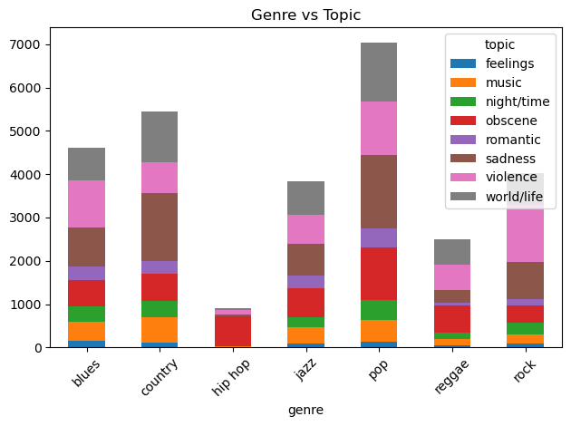

### Music Recommendation Algorithm

### In this Tlab we will analyze a dataset of songs, their lyrical features, and (optionally) their lyrical content in order to discover clusters.This dataset contains a mix of lyrical and continuous variables pulled from a 2020 research paper titled Music Dataset: Lyrics and Metadata from 1950 to 2019. Below is the data set columns:

### *artist_name: The name of the artist

track_name: The name of the song

release_date: When this song was released

genre: The categorical genre of this song

lyrics: The pre-tokenized lyrics of this song. Disclaimer: note that as this is real-world data, lyrical content is often obscene. 

len:  The number of words in the lyrics of this song

dating: A score from 0 to 1 expressing how likely it is that this song’s lyrics have something to do with dating.

violence: A score from 0 to 1 expressing how likely it is that this song’s lyrics have something to do with violence.

world/life: A score from 0 to 1 expressing how likely it is that this song’s lyrics have something to do with the world or life in general terms.

night/time: A score from 0 to 1 expressing how likely it is that this song’s lyrics have something to do night-life or time.

shake the audience: A score from 0 to 1 expressing how likely it is that this song’s lyrics have something to do with provocative feeling.

family/gospel: A score from 0 to 1 expressing how likely it is that this song’s lyrics have something to do with family-oriented content or the gospel.

romantic: A score from 0 to 1 expressing how likely it is that this song’s lyrics have something to do with romantic feeling.

communication: A score from 0 to 1 expressing how likely it is that this song’s lyrics have something to do with communication (either in romantic terms or otherwise).

obscene: A score from 0 to 1 expressing how likely it is that this song’s lyrics have something to do with obscene content (money, rockstar-lifestyle, etc).

music: A score from 0 to 1 expressing how likely it is that this song’s lyrics have something to do with music (music about music, basically).

movement/places: A score from 0 to 1 expressing how likely it is that this song’s lyrics have something to do with movement or various locations.

light/visual perceptions: A score from 0 to 1 expressing how likely it is that this song’s lyrics have something to do with the sun or other physical weather-related patterns.

family/spiritual: A score from 0 to 1 expressing how likely it is that this song’s lyrics have something to do with the importance of family or spirituality.

sadness: A score from 0 to 1 expressing how likely it is that this song’s lyrics have something to do with the importance of family or spirituality.

feelings: A score from 0 to 1 expressing how likely it is that this song’s lyrics have something to do with emotions, either positive or negative.

topic: The categorical label of lyrical content

age: A score from 0 to 1 expressing how “old” a song is from our perspective. 1 being the oldest, and 0 being the newest.

###  1. Initial EDA:

### 2 Data cleaning, pre-processing, and dimensionality reduction:
### Dropping null values, removing unnecessary columns, removing outliers, and potentially fixing incorrectly formatted data. Dropped the lyric column.
### 3.Model creation, hyperparameter search, and model evaluation:
### Implementing  a KMeans Clustering ,Based on th plot, the "elbow" appears to be around k=4 or k=5. This suggests that using 4 or 5 clusters might be a good choice for the dataset, representing a reasonable trade-off between model complexity (more clusters) and explaining the variance within the data .
### 4. Report:
###  Which insights did you gain from your EDA? Were any columns highly correlated? If so, name them.
### *In the Bivariate analysis between Genre and Release year: The Hip Hop genre has the highest median release year (around 2010-2011) and its entire Interquartile Range falls roughly between 2000 and 2017. This indicates that the majority of hip hop tracks in this dataset are from the 21st century.Overall, the plot shows clear differences in the typical release eras represented for each genre within this dataset, with a noticeable shift towards more recent years for genres like Reggae and especially Hip Hop compared to others like Country, Blues, or Jazz.*
### *In Bivariate analysis btw Genre Vs Topic: Pop has the highest overall count of topic instances. Genres like Blues, Country, Jazz, and Reggae show a more diverse mix of topics compared to the specialization seen in Hip Hop and Rock.Topics like 'sadness' and 'world/life' appear frequently across multiple genres.*
### *Based on the  heatmap (correlation matrix), here are some insights
### Sadness & Feelings --Correlation: 0.64 . Songs that express sadness also strongly convey other feelings.
### Sadness & Romantic -- Negative correlation . Songs that are more romantic tend to be less sad, and vice versa.
### Obscene & Communication --0.79 
### Movement/places & Music -- Correlation: 0.31
#### A mild correlation showing songs talking about places/movement may also focus more on music themes.
### Age & Romantic -- Correlation: -0.21
### Older audiences might be linked to slightly more romantic content.*

## How did you determine which columns to drop or keep? If your EDA informed this process, explain which insights you used to determine which columns were not needed. 

### **To determine which columns to drop or keep, I relied on insights from Exploratory Data Analysis (EDA). I dropped non-numeric and  columns that have lot of unique values like lyrics, artist_name, and track_name, which don’t contribute meaningfull to clustering and can introduce noise. I kept the numerical columns that represent song characteristics or theme scores (like romantic, violence, feelings, etc.), as these provide structured information useful for clustering. **

## What was the optimal number of clusters in your cluster model? Explain how you determined this value.

### *While the Elbow Method is shows  k=4 or k=5, the Silhouette Score clearly indicates that k=10 is the optimal number of clusters among the tested values, as it yields the highest score (0.140). Therefore, based primarily on the Silhouette analysis, the optimal number of clusters determined was 10.*